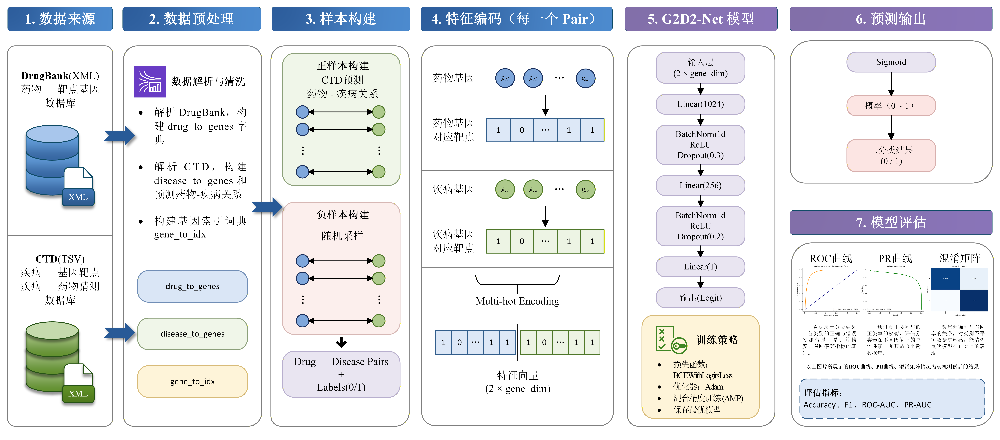

# G2D2-Net：一种面向超十万维基因特征空间的药物-疾病关联预测框架

本项目基于基因组学与药理学数据，利用深度学习模型（G2D2-Net）预测药物与疾病之间的潜在关联。项目整合高维基因靶点特征，并针对十万级稀疏特征矩阵进行了工程与内存优化。

---

## 📊 0. 写在最前 (Foreword)

本项目 G2D2-Net 仅为一个类似 Hello World、如同幼儿园过家家的机器学习入门练习，存在严重数据泄露，完全不可用于任何预测或临床场景；若有人执意咬文嚼字，则请勿惊讶于被视作未能领会此前言之人。

The G2D2‑Net project is merely a machine learning “Hello World” exercise akin to kindergarten pretend play, contains serious data leakage, and is entirely unsuitable for any prediction or clinical use; anyone who insists on nitpicking should not be surprised to be regarded as having failed to grasp this foreword.

## 📊 1. 数据集来源 (Data Sources)

由于版权限制，数据不包含在内，请从官方渠道下载。

Data is not included due to licensing restrictions. Please download from official sources.

请在运行前将数据放入 `data/` 目录：

### DrugBank 数据库

* 文件：`drugbank_all_full_database.xml`
* 来源：https://go.drugbank.com/releases/latest
* 作用：提取药物的基因靶点信息

### CTD 数据库

* 文件：`CTD_genes_diseases.tsv`
* 来源：http://ctdbase.org/downloads/
* 作用：提供疾病-基因关联数据
* 注意：此数据库的数据位置可能会发生变化，要格外留意，必要时打开查看。

---

## 💻 2. 环境配置 (Environment Setup)

本项目所使用计算机硬件和软件配置如下：

硬件配置 1：

* Intel® Core™ Ultra 9 Processor 285K (Arrow Lake)
* NVIDIA® GeForce RTX 5080 (16GB GDDR7)
* 64 GB (2 × 32 GB DDR5)

软件配置 1：
* Microsoft Windows 11 Pro for Workstations
* Python 3.12
* PyCharm 2026.1

硬件配置 2：
* Apple M4 Pro (Apple Silicon)

软件配置 2：
* macOS 26.4
* Python 3.12
* PyCharm 2026.1

推荐使用 Python 3.12，建议使用虚拟环境。

### 安装依赖包

```bash
pip install -r requirements.txt
```

### 安装 PyTorch 依赖包

需要根据自己的情况挑选下方其中一个来安装 PyTorch。

```bash
# 含有 CUDA 的机器上
pip3 install torch --index-url https://download.pytorch.org/whl/cu128

# 不含有 CUDA 的 Windows 和 Mac 机器
# Apple Silicon 芯片用此命令也会自动匹配 MPS 加速
pip3 install torch

# 不含有 CUDA 的 Linux 机器
pip3 install torch --index-url https://download.pytorch.org/whl/cpu
```

### ⚠️ GPU 与 CUDA 配置

由于作者使用 NVIDIA GeForce RTX 50 系列显卡，PyTorch 版本请根据自身显卡手动调整。

推荐选择：

| 显卡类型   | 推荐 CUDA 版本             |
| ------ | ---------------------- |
| RTX 50 | ✅ cu128（必须）            |
| RTX 40 | 👍 cu121（优先），cu128（可选） |
| RTX 30 | 👍 cu118 / cu121       |
| GTX 系列 | 👍 cu118               |

---

## ⚙️ 3. 设备支持说明

由于 CUDA 仅支持 NVIDIA 显卡：

> ❗ macOS、AMD 显卡无法使用 CUDA 版本的 PyTorch

### 3.1 自动适配

我们对代码进行了系统上的自动适配，并且也在各个地方写了我们究竟是用的什么加速方法。

### 3.2 AMD显卡的适配问题

由于团队目前缺乏 AMD 硬件环境进行实测，本项目暂时无法原生保证在 ROCm 和 DirectML 架构下的稳定性。

根据技术文档调研，Linux 用户可尝试利用 AMD 的 HIP (Heterogeneous-compute Interface for Portability) 工具链，该工具能够实现 CUDA 算子向 AMD 硬件的近乎无损迁移，理论上无需修改本项目源码即可运行。

ROCm 目前已知的问题在于 ROCm 的版本（如 6.0, 6.1）和驱动版本对运行结果影响巨大。

Windows 用户若需使用 AMD 显卡加速，建议采用 DirectML 方案，但需手动引入 torch-directml 依赖包并微调设备调用逻辑，需要记得引用相关的包和修改相关代码；或者尝试在 WSL2 上跑。

为保证程序的健壮性，源码目前将 AMD 设备默认识别并配置为 CPU 计算模式，以确保全流程能够顺畅运行。

如果您在 AMD 显卡环境（Windows DirectML 或 Linux ROCm）下成功运行了本项目，诚挚欢迎您在 Issues 中反馈运行表现，或通过 Pull Request 提交适配补丁。

特别感谢愿意分享硬件配置（GPU型号、驱动版本）与训练效率（it/s、耗时）的同学！

### 3.3 平台建议

| 平台                       | 推荐方案                         |
|--------------------------|------------------------------|
| macOS (Intel)            | CPU                          |
| macOS (Apple Silicon)    | MPS 或 CPU                    |
| Windows / Linux + NVIDIA | CUDA                         |
| Windows / Linux + AMD    | CPU（因为还没试验过 ROCm 和 DirectML） |

---

## 🚀 4. 内存优化说明

### ❌ 旧方案（已弃用）

* 全量矩阵：`[111440, 117920]`
* 内存占用：49GB+
* 峰值：100GB+
* 结果：OOM

你可以在我的注释掉的代码里找到他们，其实旧方案和当前方案算出来的准确率等指标都差不多。不过我的虚拟内存搭配物理内存提交了 145GB 才够用。

### ✅ 当前方案

#### 4.1 字典压缩

* 字符串 → 整数索引
* GB → MB

#### 4.2 动态生成 Batch

* 使用 `Dataset.__getitem__`
* 按需构造 Tensor
* 用后释放

### 优化效果

* 内存占用：40GB ~ 54.6GB（提交 74GB）
* 降低：50%+

### 优化说明

| 优化来源 | 旧方案               | 新方案                  |
|------| ----------------- |----------------------|
| 数据形式 | 巨型 numpy 矩阵 X     | (drug, disease) pair |
| 特征生成 | 提前 one-hot        | 不生成特征                |
| 内存   | ❌ 极高              | ✅ 中等                 |
| 速度   | ⚠️ 慢（for + numpy） | 🚀 快（只处理索引）          |
| 可扩展性 | ❌ 差               | ✅ 很强                 |
| 灵活性  | ❌ 固定结构            | ✅ 可换模型               |


虽然模型因为占用内存问题已优化，但仍然要警惕 Out of Memory 问题，因为考虑到 Python 对象管理与矩阵操作中间值，峰值需求可能会突破 128GB。

若执意要尝试最完整的全量矩阵，请务必保证物理内存和虚拟内存总共达到150GB，并且注意切换代码屏蔽位置。

---

## 🏃 5. 运行方式
直接执行：
```bash
python main.py
```
即可。

若想要分步骤执行，流程按照顺序执行以下文件：

### data_preprocessing.py

* 解析 DrugBank XML
* 处理 CTD 数据
* 输出：`output/processed_data.pkl`

### train_evaluate.py

* 构建 DataLoader
* 训练模型
* 输出 AUC 曲线

---

## 📂 6. 项目结构

```text
📦 G2D2-Net/
├── 📁 data/                              # 原始数据
│   ├── 🧬 ctd_genes_diseases_schema.json # 自己生成的 CTD JSON 结构定义（无需创建）
│   ├── 💾 CTD_genes_diseases.tsv         # CTD 数据库
│   ├── 🧬 drugbank.xsd                   # DrugBank XML 结构定义（无需下载）
│   └── 💾 drugbank_all_full_database.xml # DrugBank 数据库
├── 📁 figures/                           # 图片集
│   ├── 🖼️ 图1.png                        # 多热特征向量图
│   ├── 🖼️ 图1.vsdx                       # 多热特征向量图
│   ├── 🖼️ 图2.png                        # ReLU函数图
│   ├── 🖼️ 图3.png                        # Sigmoid函数图
│   ├── 🖼️ 图4.png                        # 完整多热特征向量生成图
│   ├── 🖼️ 图4.vsdx                       # 完整多热特征向量生成图
│   ├── 🖼️ 图5.png                        # 模型流程图
│   ├── 🖼️ 图5.vsdx                       # 模型流程图
│   ├── 🖼️ 图6.png                        # 模型介绍图
│   ├── 🖼️ 图6.vsdx                       # 模型介绍图
│   ├── 🖼️ 图7.png                        # ROC
│   ├── 🖼️ 图8.png                        # PR
│   ├── 🖼️ 图8.png                        # 混淆矩阵
│   └── 🖼️ framework.png                  # 模型介绍图
├── 📁 output/                            # 输出结果
│   ├── 🧾 processed_data.pkl             # 预处理数据
│   ├── 🧠 g2d2_best_model.pth            # 最好的模型权重
│   └── 📈 evaluation_plots.png           # 评估曲线
├── 🧾 data_preprocessing.py              # 数据预处理
├── 🧾 train_evaluate.py                  # 训练与评估
├── 🚀 main.py                            # 程序入口
├── 👀 README.md                          # README
└── 📜 requirements.txt                   # 依赖列表
```

---

## 📈 7. 预期结果

* **Validation Accuracy (best):** 87.87%
* **Test Accuracy:** 88.03%
* **ROC-AUC:** 0.9483
* **PR-AUC:** 0.9363
* **F1 Score:** 0.8836
* **Accuracy:** 88.03%

## 🧩 8. 模型框架结构

  
